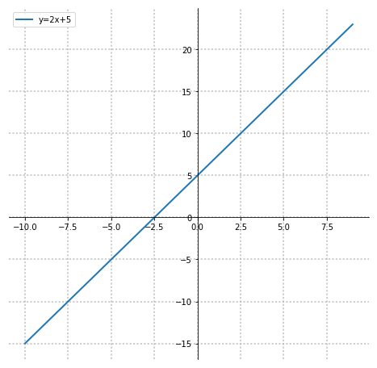
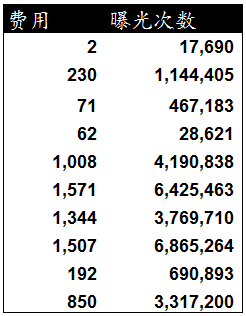
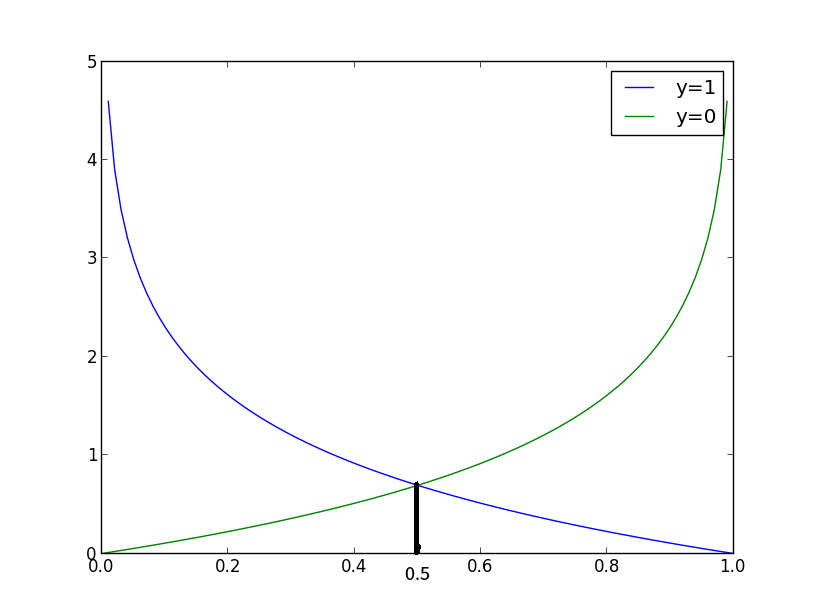
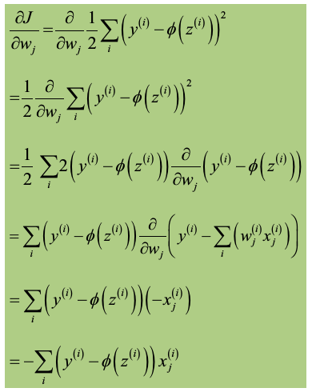

#  $$\mathbb{逻辑回归与python 代码实现}$$

逻辑回归(Logistic Regression, LR)又称为逻辑回归分析，是分类和预测算法中的一种。通过历史数据的表现对未来结果发生的概率进行预测。

例如，我们可以将商品的购买概率设置为因变量，将用户的特征属性，例如性别，年龄，注册时间等设置为自变量。根据特征属性预测购买的概率。逻辑回归与线性回归分析（Linear Regression）有很多相似之处，下面先来看下线性回归分析

## 线性回归分析

<p style="display:inline-block; font-weight:bold;color:purple;">首先，温故一下直线方程</p>

$$ y = ax + b $$

<p>自变量x乘以斜率a再加上截距b就得到了因变量y</p>


```python
import pandas as pd
import numpy as np
import matplotlib.pyplot as plt
%matplotlib inline
# from matplotlib.font_manager import FontProperties
x = np.arange(-10, 10)
a, b = 2, 5
fig, ax = plt.subplots(figsize=(8, 8))
# 隐藏上边和右边
ax.spines["top"].set_color("none") 
ax.spines["right"].set_color("none") 
# 移动另外两个轴
ax.xaxis.set_ticks_position("bottom")
ax.spines['bottom'].set_position(('data', 0))
ax.yaxis.set_ticks_position('left')
ax.spines['left'].set_position(('data', 0))
ax.plot(x, a*x+b, linewidth=2, label="y=2x+5")
ax.legend()
ax.grid(True, linestyle=":", linewidth=1.5, alpha=0.8)
```





<b>一元一次方程</b> $$\quad y \ = \ ax \ + \ b \quad 例如：\ y = 2x + 5$$  

可以写成：  $$\quad y \ = \ w_0 \times x_0 \ + \ w_1 \times x_1 \quad 其中w_0 =5, \ x_0=1, \ w_1=2, \ x_1=x$$

<b>二元一次方程</b> $$\quad y \ = \ ax \ + \ bx \ + \ c $$  

可以写成：  $$\quad y \ = \ w_0 \times x_0 \ + \ w_1 \times x_1 \ + \ w_2 \times x_2 \quad 其中x_0=1, \ w_0=c$$

<b>n元一次方程表达式及矩阵表示：</b>

$$y \ = \ w_0\times x_0 + w_1 \times x_1 + w_2 \times x_2 + \cdot\cdot\cdot \ w_n \times x_n \ $$ 

$$=\underbrace{\begin{bmatrix} w_0 & w_1 & w_2 & \cdots\ &w_n \end{bmatrix}}_{权重系数向量\bf w} {\ \bullet}  \underbrace{\begin{bmatrix} x_{0} \\ x_{1} \\ x_{2} \\ \vdots \\ x_n \end{bmatrix}}_{样本特征矩阵\bf x}$$

$$=\ {\bf w^T x} \quad {其中x_0=1}$$


<b>回归分析用来描述自变量x和因变量Y之间的关系，或者说自变量X对因变量Y的影响程度，并对因变量Y进行预测。</b> 
其中因变量(y)是我们希望获得的结果，自变量(x)是影响结果的潜在因素，自变量可以有一个，也可以有多个。一个自变量的叫做一元回归分析，超过一个自变量的叫做多元回归分析。


　　回归分析其实就是对已知公式的未知参数进行估计，在给定训练样本点和已知的公式后，去求解一个或多个未知参数，直到找到那个最符合样本点分布的参数（或参数组合）。注意，回归的前提是公式已知，否则回归无法进行。根据公式的不同，回归分为线性回归和非线性回归。线性回归中公式都是“一次”的（一元一次方程，二元一次方程...），而非线性则可以有各种形式（N元N次方程，log方程...）。

下面是一组广告费用和曝光次数的数据，费用和曝光次数一一对应。其中曝光次数是我们希望知道的结果，费用是影响曝光次数的因素，我们将费用设置为自变量X，将曝光次数设置为因变量Y，通过一元线性回归方程和判定系数可以发现费用(X)对曝光次数(Y)的影响。
<br>


以下为一元回归线性方式表达形式，$$\hat{y} \ = \ w_0 \ + \ w_1 x_1$$

其中\(\bf{\hat{y}}\)是预测的因变量，\(\bf{x_1}\)是自变量\(\bf{X}\)的一个具体值，我们只需求出截距\(w_0\)和斜率\(w_1\)就可以获得费用和曝光次数之间的关系，就可以对曝光次数进行预测。通常，可以用用最小二乘法来计算截距b0和斜率b1。最小二乘法通过最小化误差的平方和寻找数据的最佳函数匹配。


关于几个小例子可以点击<a href="http://www.cnblogs.com/nxld/p/6124235.html">这里</a>和<a href="http://blog.csdn.net/wenyusuran/article/details/25824011">这里</a>

## 逻辑回归（Logistic Regression）


Logistic Regression 是线性回归的一种，是工业界比较常用的有监督式的分类机器学习算法，用于估计某种事物的可能性，比如，用于广告预测（ctr预估），根据不同广告的点击的历史数据，来预测某广告的点击率的可能性，然后，把最可能被用户点击的广告摆在用户能看到的地方，当用户点击了该广告，网站就有钱收了。

现实生活中，我们不仅需要回归产生一个可以有很多变化的因变量，有时还需要产生类似概率值的0~1之间的数值（比如某一双鞋子今天能否卖出去？或者某一个广告能否被用户点击? 我们希望得到这个数值来辅助决策鞋子上不上架，以及广告展不展示）。这个数值必须是0~1之间，但显然线性回归不满足这个区间要求。于是引入了Logistic方程，来做归一化，即产生了逻辑回归。

在介绍逻辑回归之前，我们先看看一个小例子：
鸢尾花数据集包括三种鸢尾花，山鸢尾花(Iris Setosa)、变色鸢尾花(Iris　Versicolor)、维吉尼亚鸢尾花(Iris Virginica)

<b style="color:purple">搞清几个概念：</b>

<b>
样本

特征

分类标签

训练集(train)

测试集(test)
</b>

莺(dai)尾花数据集：\(150行\ \times \ 5列\)

特征：4个，分别是花瓣长度和宽度，花萼长度和宽度，单位cm

分类标签：最后一列，三种取值，分别代表三种类型的莺尾花


```python
import pandas as pd
df = pd.read_excel("./Iris.xls", sheetname="Iris")
print(type(df))
print(df.shape)
df.head(4)
#df.tail(4)
#df.iloc[49:54, :]
```

    <class 'pandas.core.frame.DataFrame'>
    (150, 5)


<div>
<table border="1" class="dataframe">
  <thead>
    <tr style="text-align: right;">
      <th></th>
      <th>sepal length</th>
      <th>sepal width</th>
      <th>petal length</th>
      <th>petal width</th>
      <th>iris</th>
    </tr>
  </thead>
  <tbody>
    <tr>
      <th>0</th>
      <td>5.1</td>
      <td>3.5</td>
      <td>1.4</td>
      <td>0.2</td>
      <td>Iris-setosa</td>
    </tr>
    <tr>
      <th>1</th>
      <td>4.9</td>
      <td>3.0</td>
      <td>1.4</td>
      <td>0.2</td>
      <td>Iris-setosa</td>
    </tr>
    <tr>
      <th>2</th>
      <td>4.7</td>
      <td>3.2</td>
      <td>1.3</td>
      <td>0.2</td>
      <td>Iris-setosa</td>
    </tr>
    <tr>
      <th>3</th>
      <td>4.6</td>
      <td>3.1</td>
      <td>1.5</td>
      <td>0.2</td>
      <td>Iris-setosa</td>
    </tr>
  </tbody>
</table>
</div>


### sigmoid函数

sigmoid函数，数学表达式：
$$s\left(h\right) \ = \ \frac{1}{1 \ + \ e^{-h}}$$
注意，h在这不仅仅代表我们通常意义的自变量x，还可代表多个自变量的组合。


Logistic regression可以用来做回归，也可以用来分类（主要用于二分类）。从上图可以看到sigmoid函数是一个s形的曲线，\(s\left(h\right)\)的取值在(0, 1)之间，当h=0时，\(\ s\left(h\right)=0.5\ \),在h远离0的地方函数的值会很快接近0或1。这个性质使我们能够以概率的方式来解释。

### sigmoid函数推导

其实，相比线性回归方程，逻辑回归是在线性回归的基础上增加了一个逻辑函数，即将\(\ y \ = \ ax \ + \ b \ \)作为自变量带入了sigmoid函数里（此时\(h=y= ax \ + \ b \)）。
从一个例子说起,我们通过用户的属性和特征来判断用户最终是否会进行购买一种商品。其中购买的概率是因变量y，用户的属性和特征是自变量X。y值越大说明用户购买的可能性越大。这里我们使用InOdds(E)表示这个购买事件，该事件发生的可能性（odds）来表示购买（P(E) <=> P）与未购买（P(E')）的可能性比值，公式如下：
$$InOdds\left(E\right)=W_0 + W_1 \times X_1 + W_2 \times X_2 + \cdots + W_n \times X_n +  \epsilon$$
$$Odds\left(E\right) = \frac{P \left(E \right)}{P \left(E' \right)} = \frac{P \left(E \right)}{1 - P \left(E \right)} = \frac{P}{1 - P}$$

Odds是一个从0到无穷的数字，Odds的值越大，表明事件发生的可能性越大。下面我们要将Odds转化为0-1之间的概率函数。首先对Odds取自然对数，得到logit方程，logit是一个范围在负无穷到正无穷的值。

$$logit(p) = lnOdds(p) = ln \frac{p}{1 - p} = lnp - ln(1-p)$$


基于上面的logit方程，获得以下公式：

$$logit(\pi) = lnOdds(\pi) = ln\frac{P(E)}{P(1-E)} = W_0 + W_1 \times X_1 + W_2 \times X_2 + \cdots + W_n \times X_n +  \epsilon$$

其中使用了\(\pi\)替换了公式中的P(E)，即\(\pi = P(E)\)。根据指数函数和对数函数规则得到以下公式：

$$\frac{P(E)}{1 - P(E)} = Odds(E) = e^{W_0 + W_1 \times X_1 + W_2 \times X_2 + \cdots + W_n \times X_n +  \epsilon}$$

移项，化简得到逻辑回归方程：


$$ p = P(E) = \frac{e^{w_0 + w_1 \times x_1 + w_2 \times x_2 + \cdots + w_n \times x_n}}{1 + e^{w_0 + w_1 \times x_1 + w_2 \times x_2 + \cdots + w_n \times x_n}} = \frac{1}{1 + e^{-(w_0 + w_1 \times x_1 + w_2 \times x_2 + \cdots + w_n \times x_n)}} $$


### 逻辑回归模型解读

<b>逻辑回归函数：</b> 
$$\quad s\left(h\right) \ = \ \frac{1}{1 \ + \ e^{-h}}\quad$$ 　
<div id="func" name="func">其中, \(h = w_0 + w_1 \times x_1 + w_2 \times x_2 + \cdots + w_n \times x_n \) </div>

假设有n个样本{\(\bf X\), y}，y是分类标记，取值是0或1，表示负类还是正类，\(\bf X\)是m维的样本特征向量，那么这个样本\(\bf X\)属于正类，也就是y=1的“概率”可以通过下面的逻辑函数来表示：

$$p(y=1 \mid x; w) = s(w^T x) = \frac{1}{1 + e^{- w^T x}}$$
这里的\(\bf w\)是模型参数，也称回归系数，\(\ s\)是sigmoid函数。

<b>决策函数是：</b>
$$\phi\left(x\right)=\left\{
\begin{aligned}
1 &\ \quad if\ p(y=1 \mid x)\geq 0.5 \\
0 &\ \quad otherwise.
\end{aligned}
\right.
$$
通常，我们选择0.5作为阈值，当有特定的需求时可以选择不同阈值，如果对正例的判别准确性要求高，可以选择阈值大一些，对正例的召回要求高，则可以选择阈值小一些。


<b style="margin-top:40px; display:block; font-size:22px;">模型参数求解</b>
<p style="color:purple; font-weight=bold">最大似然估计<p>
<hr style="border:1px dotted purple;">
我们要用逻辑回归函数去做分类，必须要求出模型系数\(\bf w\)，那么如何求解\(\bf w\)呢？
答案是最大似然估计（maximum likelihood）+ 梯度下降（gradient descent）。

最大似然估计的本质是，选择最佳的参数\(\bf w\),来最大化样本数据的可能性。假设给定样本\(X_1, X_2 \cdots X_n\), 那么关于参数\(\bf w\)的可能性函数(可能性函数就是样本数据作为参数w的函数的概率)：
$$lik(w) = f(X_1, X_2, X_3, \cdots X_n \mid w)$$
如果\(X_1, X_2, X_3, \cdots X_n\)之间是相互独立的，可能性函数可以简写为如下：
$$lik(w) = \prod_{i=1}^n f(X_i \mid w) \quad likelihood \ function$$

一般情况，我们要使用log可能性函数，原因：

1.对上面的likelihood function两边同时取对数，就得到了log likelihood function，这样乘积转换为求和，从而使得函数的求导更容易；

2.如果我们有很多的样本数据，若直接用likelihood function，该函数是连乘的，而且通常这些项都较小，故可能性函数就会变得很小。所以，应该采用log可能性函数，可以防止当样本可能性很小时，可能出现的数值下溢;

3.log函数是单调的，最大化可能性函数的值也就是最大化log可能性函数的值。log可能性函数公式如下：
$$l(w) = log(\ lik(w)\ ) = \sum_{i=1}^n log(\ f(X_i \mid w)\ )$$

用可能性函数来定义上面的模型系数w，要利用二项分布的概率密度函数，公式如下：
$$L(w) = \prod_{i=1}^n p(y^{(i)} \mid x^{(i)};w) = 
\prod_{i=1}^n (s(h^{(i)})^{y^{(i)}} (1 - s(h^{(i)}))^{1 - y^{(i)}}$$
其中，\(y^{(i)}\)表示第i个样本对应的分类标记值，\(x^{(i)}\)表示第i个样本的特征，\(h^{(i)}\)为第i个样本对应的假设函数的值，\(h = h(w) = w_0 + w_1 \times x_1 + w_2 \times x_2 + \cdots + w_n \times x_n\ \)上面式子两边同时求log，得到最终的log可能性函数：
$$l(w) = log(L(w)) = \sum_{i=1}^n y^{(i)} log(s(h^{(i)})) + (1 - y^{(i)}) log(1 - s(h^{(i)}))$$
<p style="color:purple; font-weight=bold">逻辑回归的cost函数<p>
<hr style="border:1px dotted purple;">
最大似然估计就是要求得使l(w)取最大值时的w，这里可以使用梯度上升法求解，若要用梯度下降法，就要乘以一个负数，在这，我们可以先直接乘以-1得到如下公式：
$$J(w) = -l(w) = -log(L(w)) = \sum_{i=1}^n -y^{(i)} log(s(h^{(i)})) - (1 - y^{(i)}) log(1 - s(h^{(i)}))$$
现在，我们就分析一个样本，那么可以把上面的cost函数写成如下形式：

$$J(w) = -ylog(s(h)) - (1 - y)log(1 - s(h))$$

當y=0時，上式的前面一項\(-ylog(s(h)) = 0\)，而當y=1時，後面一項\((1 - y)log(1 - s(h)) = 0\)，故上式可寫成如下分段函数：

$$\phi\left(x\right)=\left\{
\begin{aligned}
-log(s(h)) &\ \quad if\ y = 1 \\
-log(1 - s(h)) &\ \quad if\ y = 0
\end{aligned}
\right.
$$


好了，现在的目标是最小化cost函数，找到最佳的参数\(\bf w\)，方法是梯度下降法。
<br>
<p style="color:purple; font-weight=bold">梯度下降法求模型参数\(\bf w\)<p>
<hr style="border:1px dotted purple;">

对l(w)函数乘以\(-\frac{1}{n}\)，n是样本数量, 所以，cost函数为：
$$J(w) = -\frac{1}{n}l(w)$$
正因为乘了一个负的系数\(-\frac{1}{n}\)，所以J(w)取最小值时的w为要求的最佳参数。根据梯度下降法可得到\(\bf w\)的更新规则如下：
$$\bf w_j: = w_j \ + \ \Delta {\bf w_j}$$

$$\Delta \bf w_j = -\eta \nabla J(w)= -\eta \frac{\partial J(w)}{\partial w_j} = \eta\left(y^\left(i\right) - h_w\left(x^{(i)}\right) \right)x_j^\left(i\right)$$
其中，\(j = 1, 2, 3, \cdots m \ \)代表的是样本的第j维的特征，\(x^{(i)}\)代表的是n個樣本中的第i個樣本，\(\eta\)是学习率，是0~1之间的数，<a href="#func">\(h_w(x^{(i)})\)</a>为净输入，<a href="#func1">\(\frac{\partial J(w)}{\partial w_j}\)</a>为cost函数\(J(w)\)的梯度。
完整版的梯度下降：
$$\bf w_j: = w_j \ - \eta \sum_{i=1}^n (h_w(x^{(i)}) - y^{(i)})x_j^{(i)} \quad j = 1, 2, 3, \cdots m$$
梯度上升法：

$$\bf w_j: = w_j \ + \eta \sum_{i=1}^n (y^{(i)} - h_w(x^{(i)})x_j^{(i)}  \quad j = 1, 2, 3, \cdots m$$

因此，给定初始的模型系数\(\bf w\)后，模型就会利用梯度下降算法自动学习到合适的模型系数\(\bf w\)，拿到权重（模型）系数后，就可根据决策函数的输出对样本数据进行分类分析了。

<a href="http://blog.csdn.net/dongtingzhizi/article/details/15962797">梯度下降过程向量化</a>

vectorization后\(\bf w\)更新的步骤如下：<br>
（1）求\(A = \bf X {\bullet} {\bf w}\)；<br>
（2）求E = h(A) - y；<br>
（3）求\(w: = w -\eta {\bullet} X' {\bullet} E\)，X'表示矩阵X的转置。

<div id="func1" name="func1">

</div>

## python代码示例(sklearn)

#### 为了简化流程，从四个特征中抽取了两个特征组成特征矩阵，即选择了第一列花萼长度(sepal length) and 第三列花瓣长度(petal length) as X


```python
X = df.iloc[:, [0,2]].values  # .values　是将pandas的DataFrame或Series数据结构变成numpy的array的数组或矩阵类型
X.shape
X[-2:, :]
```


    array([[ 6.2,  5.4],
           [ 5.9,  5.1]])


```python
fig, ax = plt.subplots(figsize=(7,7))
ax.scatter(X[:50, 0], X[:50, 1], marker="o", label="setosa", c="white", edgecolor="purple")
ax.scatter(X[50:100, 0], X[50:100, 1], c="blue", marker="x", label="versicolor")
ax.scatter(X[100:, 0], X[100:, 1], marker="^", label="virginica", c="white", edgecolor="red")
ax.set_xlabel("sepal length [cm]")
ax.set_ylabel("petal length [cm]")
ax.legend(loc="upper left")
ax.grid(True)
```


seaborn绘制散点图


```python
# sns.scatterplot(x="petal length", y="sepal length", data=df, hue="iris",kind="point")
g = sns.FacetGrid(df, hue="iris", size=7, legend_out=False, hue_kws=dict(marker=["o", "x", "^"]))
g.map(plt.scatter, "sepal length", "petal length",  alpha=.7)
g.add_legend();
```


```python
df.head(3)
```


<div>
<table border="1" class="dataframe">
  <thead>
    <tr style="text-align: right;">
      <th></th>
      <th>sepal length</th>
      <th>sepal width</th>
      <th>petal length</th>
      <th>petal width</th>
      <th>iris</th>
    </tr>
  </thead>
  <tbody>
    <tr>
      <th>0</th>
      <td>5.1</td>
      <td>3.5</td>
      <td>1.4</td>
      <td>0.2</td>
      <td>Iris-setosa</td>
    </tr>
    <tr>
      <th>1</th>
      <td>4.9</td>
      <td>3.0</td>
      <td>1.4</td>
      <td>0.2</td>
      <td>Iris-setosa</td>
    </tr>
    <tr>
      <th>2</th>
      <td>4.7</td>
      <td>3.2</td>
      <td>1.3</td>
      <td>0.2</td>
      <td>Iris-setosa</td>
    </tr>
  </tbody>
</table>
</div>


```python
y = df.iloc[:, 4]
y.unique()
# 将数据集的字符类型的数据转变成数值类型,Iris-setosa标记为０,Iris-Versicolor为1，
# Iris-virginica为2
y.replace(y.unique(), [0, 1, 2], inplace=True)
Y = y.values
# Y = y.values.reshape(-1, 1)
np.shape(Y)
# np.unique(Y)
# [u'Iris-setosa', u'Iris-versicolor', u'Iris-virginica'][0, 1, 2] 
```


    (150,)


```python
X = df.iloc[:, [0,2]].values  # .values　是将pandas的DataFrame或Series数据结构变成numpy的array的数组或矩阵类型
# X[-2:, :]
np.shape(X)
```


    (150, 2)


#### 调用sklearn库的类LogisticRegression，实现对Iris训练集的学习，用交叉验证检验分类效果，最终将训练好的模型应用在测试集进行验证


```python
from sklearn.model_selection import train_test_split	
from sklearn.model_selection import cross_val_score	
from sklearn.preprocessing import StandardScaler
from sklearn.linear_model import LogisticRegression
from sklearn.metrics import accuracy_score

X_train, X_test, y_train, y_test = train_test_split(X, Y, test_size=0.3, random_state=0)
sc = StandardScaler()
sc.fit(X_train)
X_train_std = sc.transform(X_train)
X_test_std = sc.transform(X_test)
X_combined_std = np.vstack((X_train_std, X_test_std))
y_combined = np.hstack((y_train, y_test))
lr = LogisticRegression(C=100, penalty="l2", random_state=0, tol=1e-6)
lr.fit(X_train_std, y_train)
lr.predict_proba(X_test_std[0, :].reshape(1, -1))
# np.shape(X_test_std[0, :]),要整形为（１，　－１）
# np.shape(y_train)
y_pred = lr.predict(X_test_std)
print("Misclassified samples: %d" % (y_test != y_pred).sum())
print("Accuracy: %.2f" % accuracy_score(y_test,y_pred))
print("cross validation score: %s" % cross_val_score(lr, X_train_std, y_train, cv=5))
print("mean cross validation score: %s" % cross_val_score(lr, X_train_std, y_train, cv=5).mean())
```

    Misclassified samples: 1
    Accuracy: 0.98
    cross validation score: [ 0.95454545  1.          1.          0.9047619   0.94736842]
    mean cross validation score: 0.961335156072


查看模型是否过拟合可以用learning curve来查看，过拟合现象表现为，在训练集上准确率得分比较高，但交叉验证集上得分较低，中间gap较大，一般是模型过于复杂导致，但一般随着样本量增加，过拟合会减弱。与之相反的还有欠拟合，即模型复杂度不够，训练集和交叉验证集的得分均较低。


<b><span style="margin:0px, 100px, 0px, 120px;display:inline-block;">欠擬合</span><span style="margin:0px, 100px, 0px, 120px;display:inline-block;">最佳擬合</span><span style="margin:0px, 100px, 0px, 100px;display:inline-block;">過擬合</span></b>　


```python
from sklearn.model_selection import learning_curve
# 用sklearn的learning_curve得到training_score和cv_score，使用matplotlib画出learning curve
def plot_learning_curve(estimator, title, X, y, ylim=None, cv=5, n_jobs=1, 
                        train_sizes=np.linspace(.05, 1., 20), verbose=0, plot=True):
    """
    画出data在某模型上的learning curve.
    参数解释
    ----------
    estimator : 使用的分类器。
    title : 图的标题。
    X : 输入的feature，numpy类型
    y : 输入的target vector
    ylim : tuple格式的(ymin, ymax), 设定图像中纵坐标的最低点和最高点
    cv : 做cross-validation的时候，数据分成的份数，其中一份作为cv集，其余n-1份作为training(默认为3份)
    n_jobs : 并行的的任务数(默认1)
    """
    train_sizes, train_scores, test_scores = learning_curve(
        estimator, X, y, cv=cv, n_jobs=n_jobs, train_sizes=train_sizes, verbose=verbose)

    train_scores_mean = np.mean(train_scores, axis=1)  # train_scores是一个２０行５列的ndarry,20为从样本取的不同比例的样本数据作为X, 而５表示５次交叉验证
    train_scores_std = np.std(train_scores, axis=1)
    test_scores_mean = np.mean(test_scores, axis=1)
    test_scores_std = np.std(test_scores, axis=1)

    if plot:
        plt.figure(figsize=(7,7))
        plt.title(title)
        if ylim is not None:
            plt.ylim(*ylim)
        plt.xlabel("samples")
        plt.ylabel("scores")
        # plt.gca().invert_yaxis() 例如y轴坐标3000-10000，调整为10000-3000来显示
        plt.fill_between(train_sizes, train_scores_mean - train_scores_std, train_scores_mean + train_scores_std, 
                         alpha=0.2, color="b")
        plt.fill_between(train_sizes, test_scores_mean - test_scores_std, test_scores_mean + test_scores_std, 
                         alpha=0.2, color="r")
        plt.plot(train_sizes, train_scores_mean, '^-', color="blue", label="train score")
        plt.plot(train_sizes, test_scores_mean, 'v-', color="red", label="cross_validation score")
        plt.legend(loc="best")
        plt.grid(True)
        plt.show()                
plot_learning_curve(lr, "learning curve", X_train_std, y_train)
```

### 决策边界示意图


```python
from matplotlib.colors import ListedColormap
import matplotlib.pyplot as plt
def plot_decision_regions(X, Y, classifier, test_idx=None, resolution=0.02):
    # 对应分类标签
    y_maps = {"1":"Iris-versicolor", "0":"Iris-setosa", "2": "Iris-virginica"}
    # setup marker generator and color map
    markers = ("^", "x", "s", "o", "v")
    colors = ("purple", "red", "blue", "cyan", "lightgreen", )  #"gray"
    cmap = ListedColormap(colors[:len(np.unique(Y))])
    # plot the decision surface    
    x1_min, x1_max = X[:, 0].min() - 1, X[:, 0].max() + 1
    x2_min, x2_max = X[:, 1].min() - 1, X[:, 1].max() + 1
    xx1, xx2 = np.meshgrid(np.arange(x1_min, x1_max, resolution), np.arange(x2_min, x2_max, resolution))
    Z = classifier.predict(np.array([xx1.ravel(), xx2.ravel()]).T)
    Z = Z.reshape(xx1.shape)
    plt.figure(figsize=(8,8))
    plt.contourf(xx1, xx2, Z, alpha=0.4, cmap=cmap)          
    plt.xlim(xx1.min(), xx1.max())
    plt.ylim(xx2.min(), xx2.max())
    # plot all samples
    for idx, cl in enumerate(np.unique(Y)):        
        plt.scatter(x=X[Y==cl, 0], y=X[Y==cl, 1], alpha=0.8, c=cmap(idx), marker=markers[idx],label=y_maps[str(cl)])        
    # highlight test samples
    if test_idx:
        X_test, Y_test = X[test_idx, :], Y[test_idx]
        X_test, Y_test = X[test_idx, :], Y[test_idx]
        plt.scatter(X_test[:, 0], X_test[:, 1], c="", alpha=1.0, linewidth=1, marker="o", s=55, label="test set")
```


```python
plot_decision_regions(X=X_combined_std, Y=y_combined, classifier=lr, test_idx=None)
plt.xlabel("sepal length [standardized] cm", fontsize=16)
plt.ylabel("petal length [standardized] cm", fontsize=14)
plt.legend(loc="upper left")
```


    <matplotlib.legend.Legend at 0x7fdd1fee2f50>


## 参考文献

【机器学习笔记1】Logistic回归总结 http://blog.csdn.net/dongtingzhizi/article/details/15962797

【机器学习笔记2】Linear Regression总结 http://blog.csdn.net/dongtingzhizi/article/details/16884215

Logistic Regression 模型简介　https://tech.meituan.com/intro_to_logistic_regression.html

逻辑回归算法的原理及实现(LR) http://www.cnblogs.com/nxld/p/6124235.html

逻辑回归（Logistic regression）详解-并用scikit-learn训练逻辑回归拟合Iris数据集  http://blog.csdn.net/xlinsist/article/details/51289825


 Sklearn-LogisticRegression逻辑回归 http://blog.csdn.net/cherdw/article/details/54891073
 
 机器学习算法与Python实践之（七）逻辑回归（Logistic Regression） http://blog.csdn.net/zouxy09/article/details/20319673
 
 机器学习算法与Python实践之（七）逻辑回归（Logistic Regression http://blog.csdn.net/wenyusuran/article/details/25824011
 
 正则化方法：L1和L2 regularization、数据集扩增、dropout http://blog.csdn.net/u012162613/article/details/44261657
 
 LaTeX 各种命令符号 http://blog.csdn.net/anxiaoxi45/article/details/39449445
 
 
