# 单层感知器简介

 感知器(perceptron)是模仿人脑神经元的线性分类算法

<p style="margin-top:10px; color:red;">神经元的构成如下图所示，主要包括树突(Dendrites)，细胞核(Cell Body)和轴突(Axon)。</p>
<p>感知器是一种研究单个训练样本的二元分类器。</p>


 神经元及单层感知器示意图
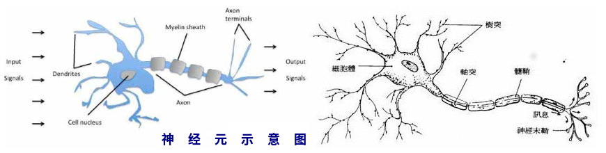 
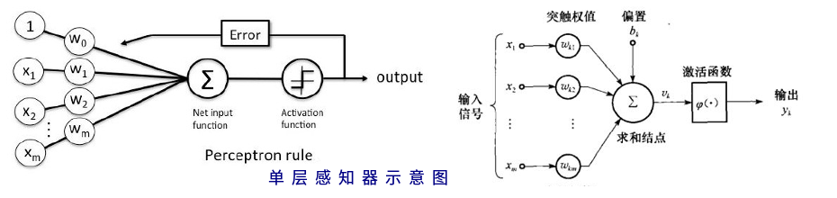 

## 为啥要扯淡感知器
<p>理解感知器的工作原理，是学习两种超级武器的基础，即支持向量机(support vector machines)和人工神经网络(artificial neural networks)的基础之一</p>

<p style="display:inline-block; font-weight:bold;color:purple;">首先，温故一下直线方程</p>
$$ y = ax + b $$
<p>自变量x乘以斜率a再加上截距b就得到了因变量y</p>


```python
import pandas as pd
import numpy as np
import matplotlib.pyplot as plt
%matplotlib inline
```


```python
x = np.arange(-10, 10)
a, b = 2, 5
fig, ax = plt.subplots()
# 隐藏上边和右边
ax.spines["top"].set_color("none") 
ax.spines["right"].set_color("none") 
# 移动另外两个轴
ax.xaxis.set_ticks_position("bottom")
ax.spines['bottom'].set_position(('data', 0))
ax.yaxis.set_ticks_position('left')
ax.spines['left'].set_position(('data', 0))
ax.plot(x, a*x+b, linewidth=2, label="y=2x+5")
ax.legend()
ax.grid(True, linestyle=":", linewidth=1, alpha=0.8)
```


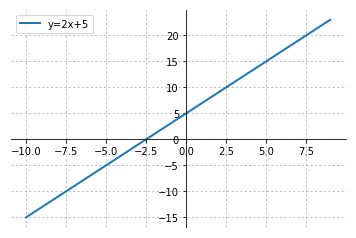


<p style="display:inline-block; font-weight:bold;color:purple;">n元一次方程</p>

一元一次方程:
\(\quad y \ = \ ax \ + \ b \quad 例如：\ y = 2x + 5\)  
可以写成：  
\(\quad y \ = \ w_0 \times x_0 \ + \ w_1 \times x_1 \quad 其中w_0 =5, \ x_0=1, \ w_1=2, \ x_1=x \)

二元一次方程:
\(\quad y \ = \ ax \ + \ bx \ + \ c \)  
可以写成：  \(\quad y \ = \ w_0 \times x_0 \ + \ w_1 \times x_1 \ + \ w_2 \times x_2 \quad 其中x_0=1, \ w_0=c\)

n元一次方程表达式及矩阵表示：

$$y \ = \ w_0\times x_0 + w_1 \times x_1 + w_2 \times x_2 + \cdot\cdot\cdot \ w_n \times x_n \ $$ 

$$=\underbrace{\begin{bmatrix} w_0 & w_1 & w_2 & \cdots\ &w_n \end{bmatrix}}_{权重系数向量\bf w} {\ \bullet}  \underbrace{\begin{bmatrix} x_{0} \\ x_{1} \\ x_{2} \\ \vdots \\ x_n \end{bmatrix}}_{样本特征矩阵\bf x}$$

$$=\ {\bf w^T x} \quad {其中x_0=1}$$

## 感知器的概念剖析

<p style="display:inline-block; font-weight:bold;color:purple;">神经元的工作原理:</p>
树突从一个或多个其他神经元接受电信号，信号在其细胞核处理后从轴突输出。一个感知器就是将一个或多个输入\(x_0, x_1, x_2 \cdot\cdot\cdot x_n \)处理并输出的计算单元。每个输入代表了一个特征，通常，感知器用一个特定的输入单元代表输入误差项，其表达式是  \(\quad x_0\times \theta \quad 其中x_0=1,\ \theta为阈值\)

<p style="display:block; font-weight:bold;color:purple;">净输入:
<span>将所有的输入单元值(即样本特征值)乘以对应的权重系数再加上误差项就得到了净输入z</span></p>

$$ z = \underbrace{w_0x_0}_{=\theta\times1} + \underbrace{w_1x_1 + w_2x_2 + \cdots + w_nx_n}_{样本特征值与权重系数乘积之和}= {\bf w^T}{\bf x}$$

<p style="display:inline-block; font-weight:bold;color:purple;">激励函数:</p>
常用的激励函数有多种，如阶跃函数(unit step function或Heaviside step function)和逻辑S形函数(logistic sigmoid)。

以下示例使用的均是最简单的阶跃函数。
$$\phi\left(x\right)=\left\{
\begin{aligned}
1 &\ \quad if\ z\geq \theta \\
-1 &\ \quad otherwise.
\end{aligned}
\right.
$$
<p style="color:red">阶跃函数&nbsp;\(\ \theta=0 \)</p>

阶跃函数


<p style="display:inline-block; font-weight:bold;color:purple;">感知器执行流程:</p>
感知器是一种错误驱动(error-drive)的学习算法。感知器学习算法首先要将权重系数 (\(\bf w_i \)) 设置成０或很小的随机数，然后预测训练样本的类型。若感知器的预测与实际值一致，则权重系数不改变，如果感知器预测错误，算法就更改权重系数，接着，将权重传递给下一个样本作为下一个样本的初始权重并继续处理下一个样本；当样本集中的所有样本均被学习一遍后，本世代学习结束，并开始下一世代的学习和训练，就这样循环指定的世代数后，学习结束。

<b>权重系数的更新规则</b>:
$$\bf w_j:=w_j \ + \ \Delta {\bf w_j}$$

$$\Delta \bf w_j=\eta\left(y^\left(i\right)-\hat{y}^\left(i\right) \right)x_j^\left(i\right)$$

其中，\(\bf w_j:\)是样本集第j维特征更新后的权重，\(\bf w_j\)是当前样本的上一个样本计算得到的权重，\(\Delta \bf w_j\)是根据当前样本计算的权重的增量，\(\eta\)是人为指定的超参数——学习率(learning rate, a constant between 0.0 and 1.0)，\(y^\left(i\right)\)是当前样本的分类标签值，\(\hat{y}^\left(i\right)\)是预测的分类标签的值，\(x_j^\left(i\right)\)是第i个样本的第j维特征。

\(\bf w\)的更新规则与梯度下降法中的权重更新规则类似，都是朝着使样本得到正确分类的方向更新权重，且更新的幅度是由学习速率(\(\eta\))控制的。每遍历一次样本集的所有样本称完成了一世代(epoch)。若学习完一世代后，所有的样本都分类正确，那么算法就会收敛(converge)。要注意的是，感知器的学习算法并不保证算法本身的收敛，当样本是线性不可分的时候，是不可能收敛的。因此，要指定一个超参数(\(n_{iter}\))来限制权重更新的最大世代数。

<p style="display:inline-block; font-weight:bold;color:purple;">一个小案例:</p>
<span>从一窝猫里分辨幼猫or成年猫</span>

<p style="font-weight:bold;color:purple;">搞清几个概念：</p>
<b>

样本

特征

分类标签

训练集(train)

测试集(test)</b>

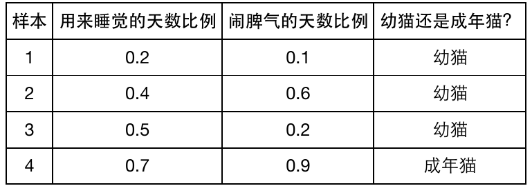


```python
# 创建样本特征矩阵
X = np.array([
    [0.2, 0.1],
    [0.4, 0.6],
    [0.5, 0.6],
    [0.7, 0.9]
])
# 创建分类标签
y = [1, 1, 1, 0]
# 散点图
plt.grid(True, linestyle=":", linewidth=1, alpha=0.8)
plt.scatter(X[:3, 0], X[:3, 1], marker="o", c="white", edgecolor="red")
plt.scatter(X[3:, 0], X[3:, 1], marker="x")
plt.xlabel("pro of sleep day", fontsize=16)
plt.ylabel("pro of crazy day", fontsize=16)
plt.title("character of kitten and adult cats", fontsize=14)
```


    <matplotlib.text.Text at 0x7f7920cb6190>


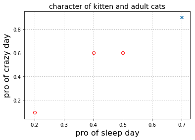


<p style="display:inline-block; font-weight:bold;color:purple;">权重更新过程</p>
世代１，即第一次循环，开始的时候，所有的权重设置为0,\(w_1=0,w_2=0,w_3=0\)
特征分别为\(x_0=1, x_1=0.2, x_2=0.1\)
根据净输入和激励函数决定是否更改权重系数

<p style="display:block; font-weight:bold;color:purple;">净输入z和激励函数 \(\phi\left(x\right)\) </p>
\( z = \underbrace{w_0x_0}_{=\theta\times1} + \underbrace{w_1x_1 + w_2x_2 + \cdot\cdot\cdot +w_nx_n}_{输入单元值与权重系数乘积之和}= {\bf w^T}{\bf x}\quad\)　\(\phi\left(x\right)=\left\{
\begin{aligned}
1 &\ \quad if\ z\gt \theta \\
0 &\ \quad otherwise.
\end{aligned}
\right. \)

<p style="display:block; font-weight:bold;color:purple;">权重更新</p>
$$\bf w_j:=w_j \ + \ \Delta \bf w_j \quad$$
$$\quad \Delta \bf w_j=\eta\left(y^\left(i\right)-\hat{y}^\left(i\right) \right)x_j^\left(i\right)$$

<span style="color:purple">初始权重\(\ w_0 = \left[0, 0, 0 \right]\)</span>，为了简化计算，令<span style="color:orange;">\(\eta=1.0\)</span>　
<p style="display:block; font-weight:bold;color:blue;">第一世代，感知器学习第一个样本对权重系数的更新过程</p>

第一个样本特征值为：\(x_0=\left[1.0,0.2,0.1\right]\)
根据权重更新的公式，计算w的增量：

$$\Delta \bf w_j=\eta\left(y^\left(i\right)-\hat{y}^\left(i\right) \right)x_j^\left(i\right) $$ 

$$= 1.0\times \left(实际标签值－预测标签值\right) \times \underbrace{向量\bf x}_{第一个样本的特征向量} \quad $$

$$= 1.0\times \left(1－0\right) \times \left[1.0, 0.2, 0.1 \right] $$ 

$$= \left[1.0, 0.2, 0.1 \right]$$

因此，由\(\bf w_j:=w_j \ + \ \Delta \bf w_j \)得更新后的权重: \(\bf w = \left[0,0,0\right] \ + \ \left[1.0,0.2,0.1\right] = \left[1.0,0.2,0.1\right]\) 

第一世代的第一个样本学习完毕，将从第一个样本学习到的权重<span style="color:purple;">\(\bf w=\left[1.0,0.2,0.1\right]\)</span>传递给下一个样本作为初始权重接着学习。下面探讨第二个样本权重更新过程：
初始权重<span style="color:purple;">\(w_1 = \left[1.0,0.2,0.1\right]\)</span>，<span style="color:orange;">\(\eta=1.0\)</style>
<p style="display:block; font-weight:bold;color:blue;">第一世代，感知器学习第二个样本对权重系数的更新过程</p>

第二个样本特征值为：\(x_１=\left[1.0,0.4,0.6\right]\)

净输入：\(z={\bf w^T}{\bf x}=w_0x_0 + w_1x_1 + w_2x_2 + \cdot\cdot\cdot +w_nx_n = 1.0\times1.0 + 0.2\times0.4 + 0.1\times0.6 = 1.14 \gt0 \)

根据激励函数\(\phi\left(x\right)=\left\{
\begin{aligned}
1 &\ \quad if\ z\geq \theta \\
0 &\ \quad otherwise.
\end{aligned}
\right.
\)
可知预测值为1,预测分类标签值与实际分类标签值相同；

更新权重：\(\Delta \bf w_j=\eta\left(y^\left(i\right)-\hat{y}^\left(i\right) \right)x_j^\left(i\right)　＝　1.0\times \left(1.0-1.0\right)\times \left[1.0,0.4,0.6\right] = \left[0,0,0\right]\)

\(\bf w_j:=w_j \ + \ \Delta \bf w_j = \left[1.0,0.2,0.1\right] + \left[0,0,0\right] = \left[1.0,0.2,0.1\right]\)

在学习第二个样本的时候，由于正确地预测了分类标签，所以权重系数没有改变。至此，第二个样本学习完毕，并将权重<span style="color:purple;">\(w_1=\left[1.0,0.2,0.1\right]\)</span>传给下一个样本作为初始权重。

<p style="display:block; font-weight:bold;color:blue;">第一世代，感知器学习剩余样本对权重系数的更新过程同上</p>

就这样对每个样本进行学习得到权重并依次传递，由于本案例只有4个样本，在第一世代下，还需要对第三个和第四个样本进行学习得到相应的权重，这样，第一世代学习完毕，接着执行第二世代的学习，过程和第一世代是类似的，如此循环直至达到设置的最大世代数，整个训练集的学习过程就结束了。

训练集学习完毕后，就可以对测试集进行预测、调参等工作，在这，为了简化流程，这里没有提及在对训练集进行训练之前的数据清洗、特征工程等一系列工作，当然对于本示例也不需要，因为该数据集本身就是干净的。


```python
# 权重系数更新过程
display(Image('./image/cats_epoch.png'))
```


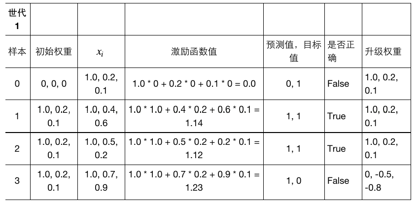


### numpy进行矩阵运算小示例


```python
import numpy as np
a = np.array([2, -1, 3])
b = np.array([1, 0, -1])
print("矩阵加法：{0} + {1} = {2}".format(a, b, a + b)) 
print("矩阵点乘：{0} . {1} = {2}".format(a, b, np.dot(a, b)))
print("矩阵对应元素相乘，Hadamard乘积：{0} × {1} = {2}".format(a, b, a*b))
print("矩阵与标量相乘：{0} × {1} = {2}".format(2, a, 2*a))
```

    矩阵加法：[ 2 -1  3] + [ 1  0 -1] = [ 3 -1  2]
    矩阵点乘：[ 2 -1  3] . [ 1  0 -1] = -1
    矩阵对应元素相乘，Hadamard乘积：[ 2 -1  3] × [ 1  0 -1] = [ 2  0 -3]
    矩阵与标量相乘：2 × [ 2 -1  3] = [ 4 -2  6]


<b>Hadamard乘积：</b>
矩阵与矩阵的Hadamard积就是两个矩阵对应元素的乘积

<b>Kronecker乘积：</b>
Kronecker积是两个任意大小的矩阵间的运算，克罗内克积也成为直积或张量积，以德国数学家利奥波德·克罗内克命名。


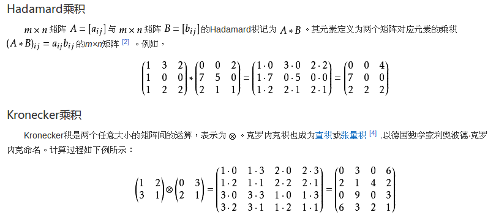


```python
import numpy as np 
w3 = np.array([1, 0.2, 0.1])
update = np.array([-1, -0.7, -0.9])
w4 = w3 + update
w4
```


    array([ 0. , -0.5, -0.8])


## python实现的单层感知器

莺(dai)尾花数据集　\(150行\ \times \ 5列\)

特征：4个，分别是花瓣长度和宽度，花萼长度和宽度，单位cm

分类标签：最后一列，三种取值，分别代表三种类型的莺尾花


```python
df = pd.read_excel("./Iris.xls", sheetname="Iris")
```


```python
df.head(3)
```


<div>
<table border="1" class="dataframe">
  <thead>
    <tr style="text-align: right;">
      <th></th>
      <th>sepal length</th>
      <th>sepal width</th>
      <th>petal length</th>
      <th>petal width</th>
      <th>iris</th>
    </tr>
  </thead>
  <tbody>
    <tr>
      <th>0</th>
      <td>5.1</td>
      <td>3.5</td>
      <td>1.4</td>
      <td>0.2</td>
      <td>Iris-setosa</td>
    </tr>
    <tr>
      <th>1</th>
      <td>4.9</td>
      <td>3.0</td>
      <td>1.4</td>
      <td>0.2</td>
      <td>Iris-setosa</td>
    </tr>
    <tr>
      <th>2</th>
      <td>4.7</td>
      <td>3.2</td>
      <td>1.3</td>
      <td>0.2</td>
      <td>Iris-setosa</td>
    </tr>
  </tbody>
</table>
</div>


为了可以画２D图，只抽取了前100行数据，即仅仅包含50个样本的 Iris-Setosa and 50个样本的 Iris-Versicolor flowers


```python
y = df.iloc[0:100, 4].values  # get a 1-array, numpy.ndarray
y[-5:]
```


    array([u'Iris-versicolor', u'Iris-versicolor', u'Iris-versicolor',
           u'Iris-versicolor', u'Iris-versicolor'], dtype=object)


```python
# 将数据集的所有字符类型的数据转变成数值类型
Y = np.where(y=="Iris-setosa", -1, 1)
Y[-5:]
```


    array([1, 1, 1, 1, 1])


为了简化流程，从四个特征中抽取了两个特征组成特征矩阵，即选择了第一列(sepal length) and 第三列(petal length) as X


```python
X = df.iloc[0:100, [0,2]].values  # .values　是将pandas的DataFrame或Series数据结构变成numpy的array的数组或矩阵类型
X.shape
X[-2:, :]
```


    array([[ 5.1,  3. ],
           [ 5.7,  4.1]])


#### 样本特征的散点图


```python
plt.scatter(X[:50, 0], X[:50, 1], marker="o", label="setosa", c="white", edgecolor="purple")
plt.scatter(X[50:100, 0], X[50:100, 1], c="blue", marker="x", label="versicolor")
plt.xlabel("petal length [cm]")
plt.ylabel("sepal length [cm]")
plt.legend(loc="upper left")
plt.show()
```


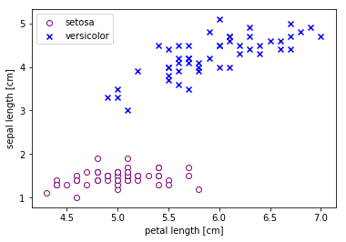


### Perceptron感知器分类器


```python
class Perceptron(object):
    """Perceptron classifier单层感知器"""
    def __init__(self, eta=0.01, n_iter=10):
        self.eta = eta
        self.n_iter = n_iter
        
    #拟合
    def fit(self, X, Y):
        self.w_ = np.zeros(1 + X.shape[1])
        self.errors_ = []
        print("length of w_ : %i") % len(self.w_)
        for i in range(self.n_iter):
            errors = 0
            for xi, target in zip(X, Y):
                update = self.eta * (target - self.predict(xi)) # update是一个数值　
                self.w_[1:] += update * xi  # 数组上操作，不是数值加
                self.w_[0] += update
                errors += int(update != 0.0)
            self.errors_.append(errors)
            print("epoch_"+str(i + 1))
            print(self.w_)
        return self
    
    #净输入
    def net_input(self, X):
        return np.dot(X, self.w_[1:]) + self.w_[0]
    
    #激励函数预测
    def predict(self, X):
        return np.where(self.net_input(X) >= 0.0, 1, -1)

# 预测未知样本 
#     def predict_real(self, X):
#         y_real = {"1":"Iris-versicolor", "-1":"Iris-setosa"}
#         y_ = self.net_input(X)        
#         return y_real[str(y_)]                
```

#### 感知器训练过程中分类标签预测错误的情况


```python
ppn = Perceptron(eta=0.1, n_iter=10)
ppn.fit(X, Y)
plt.plot(range(1, len(ppn.errors_)+1), ppn.errors_, marker=".", color="purple")
plt.xlabel("Epochs", fontsize=16)
plt.ylabel("Number of Misclassification", fontsize=14)
plt.grid(True, linestyle=":", alpha=0.8)
plt.show()
```

    length of w_ : 3
    epoch_1
    [ 0.    0.38  0.66]
    epoch_2
    [ 0.    0.76  1.32]
    epoch_3
    [-0.2   0.22  1.68]
    epoch_4
    [-0.2   0.34  2.1 ]
    epoch_5
    [-0.4  -0.68  1.82]
    epoch_6
    [-0.4  -0.68  1.82]
    epoch_7
    [-0.4  -0.68  1.82]
    epoch_8
    [-0.4  -0.68  1.82]
    epoch_9
    [-0.4  -0.68  1.82]
    epoch_10
    [-0.4  -0.68  1.82]


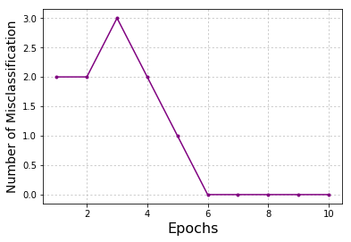


### 感知器分类决策边界示意图
implement a small convenience function to visualize the decision boundaries for 2D datasets

np.meshgrid是生成网格采样点的函數，它接收两个一维数组,产生两个二维矩阵

contour:轮廓,等高线,f：filled，也即对等高线间的填充区域进行填充（使用不同的颜色）；

contourf：将不会再绘制等高线（显然不同的颜色分界就表示等高线本身）


```python
from matplotlib.colors import ListedColormap
def plot_decision_regions(X, Y, classifier, resolution=0.02):
    # 对应分类标签
    y_maps = {"1":"Iris-versicolor", "-1":"Iris-setosa"}
    # setup marker generator and color map
    markers = ("^", "x", "s", "o", "v")
    colors = ("purple", "red", "blue", "cyan", "lightgreen", )  #"gray"
    cmap = ListedColormap(colors[:len(np.unique(Y))])
    # plot the decision surface
    x1_min, x1_max = X[:, 0].min() - 1, X[:, 0].max() + 1
    x2_min, x2_max = X[:, 1].min() - 1, X[:, 1].max() + 1
    xx1, xx2 = np.meshgrid(np.arange(x1_min, x1_max, resolution), np.arange(x2_min, x2_max, resolution))
    Z = classifier.predict(np.array([xx1.ravel(), xx2.ravel()]).T)
    Z = Z.reshape(xx1.shape)
    plt.contourf(xx1, xx2, Z, alpha=0.4, cmap=cmap)  
    
    plt.xlim(xx1.min(), xx1.max())
    plt.ylim(xx2.min(), xx2.max())
    # plot class samples
    for idx, cl in enumerate(np.unique(Y)):
        plt.scatter(x=X[Y==cl, 0], y=X[Y==cl, 1], alpha=0.8, c=cmap(idx), marker=markers[idx],label=y_maps[str(cl)])
```


```python
plot_decision_regions(X, Y, classifier=ppn)
plt.xlabel("sepal length [cm]", fontsize=18)
plt.ylabel("petal length [cm]", fontsize=18)
plt.legend(loc="upper left")
plt.show()
```


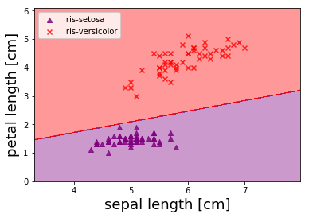


## sklearn感知器代码实现


```python
from sklearn.preprocessing import StandardScaler  # 标注变换之标准化
from sklearn.linear_model import Perceptron as percep
from sklearn.cross_validation import train_test_split as ttsplit
from sklearn.metrics import accuracy_score
X_train, X_test, Y_train, Y_test = ttsplit(X, Y, test_size=0.2, random_state=0)

sc = StandardScaler()
sc.fit(X_train)  # 计算均值和方差
X_train_std = sc.transform(X_train)  # 进行标准变换，变成标准正太分布
X_test_std = sc.transform(X_test)
ppn_ = percep(n_iter=10, eta0=0.1, random_state=0)
ppn_.fit(X_train_std, Y_train)
Y_pred = ppn_.predict(X_test_std)
print("Misclassified samples: %d" % (Y_test != Y_pred).sum())
print("Accuracy: %.2f" % accuracy_score(Y_test,Y_pred))
```

    Misclassified samples: 1
    Accuracy: 0.95


    /home/darren/anaconda2/lib/python2.7/site-packages/sklearn/cross_validation.py:44: DeprecationWarning: This module was deprecated in version 0.18 in favor of the model_selection module into which all the refactored classes and functions are moved. Also note that the interface of the new CV iterators are different from that of this module. This module will be removed in 0.20.
      "This module will be removed in 0.20.", DeprecationWarning)


```python
from matplotlib.colors import ListedColormap
import matplotlib.pyplot as plt
def plot_decision_region(X, Y, classifier, test_idx=None, resolution=0.02):
    # 对应分类标签
    y_maps = {"1":"Iris-versicolor", "-1":"Iris-setosa"}
    # setup marker generator and color map
    markers = ("^", "x", "s", "o", "v")
    colors = ("purple", "red", "blue", "cyan", "lightgreen", )  #"gray"
    cmap = ListedColormap(colors[:len(np.unique(Y))])
    # plot the decision surface    
    x1_min, x1_max = X[:, 0].min() - 1, X[:, 0].max() + 1
    x2_min, x2_max = X[:, 1].min() - 1, X[:, 1].max() + 1
    xx1, xx2 = np.meshgrid(np.arange(x1_min, x1_max, resolution), np.arange(x2_min, x2_max, resolution))
    Z = classifier.predict(np.array([xx1.ravel(), xx2.ravel()]).T)
    Z = Z.reshape(xx1.shape)
    plt.contourf(xx1, xx2, Z, alpha=0.4, cmap=cmap)      
    plt.xlim(xx1.min(), xx1.max())
    plt.ylim(xx2.min(), xx2.max())
    # plot all samples
    for idx, cl in enumerate(np.unique(Y)):
        plt.scatter(x=X[Y==cl, 0], y=X[Y==cl, 1], alpha=0.8, c=cmap(idx), marker=markers[idx],label=y_maps[str(cl)])
    # highlight test samples
    if test_idx:
        X_test, Y_test = X[test_idx, :], Y[test_idx]
        X_test, Y_test = X[test_idx, :], Y[test_idx]
        plt.scatter(X_test[:, 0], X_test[:, 1], c="", alpha=1.0, linewidth=1, marker="o", s=55, label="test set")
```


```python
X_combined_std = np.vstack((X_train_std, X_test_std))
Y_combined = np.hstack((Y_train, Y_test))
plot_decision_region(X=X_combined_std, Y=Y_combined, classifier=ppn_, test_idx=None)
plt.xlabel("sepal length [standardized] cm", fontsize=16)
plt.ylabel("petal length [standardized] cm", fontsize=14)
plt.legend(loc="upper left")
plt.show()
```


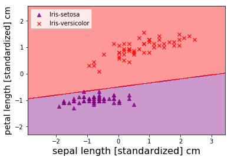

